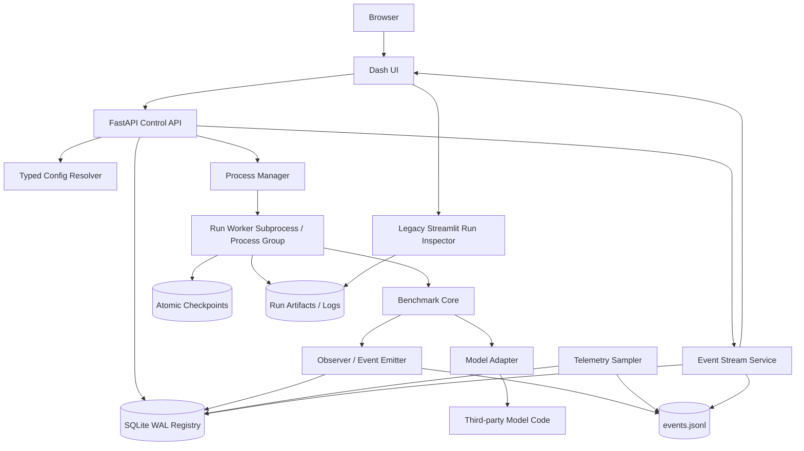

# Benchmark Execution Visualization Tool — Target Architecture and MVP Plan

## 1. 목표

최종 도구는 benchmark를 단순히 실행하는 UI가 아니라, 다음 전체 lifecycle을 다루는 local experiment platform이다.

```text
Preset/Config
  → Validate/Resolve
  → Allocate immutable run
  → Launch worker
  → Observe metrics/log/resources
  → Stop/Fail/Complete
  → Checkpoint/Resume/Warm start
  → Evaluate/Post-hoc compare
  → Reproduce/Clone
```

## 2. 설계 원칙

1. **Frontend-agnostic backend**  
   Dash는 현재 선택된 UI일 뿐, run identity, process manager, event, checkpoint code는 Dash를 import하지 않는다.

2. **One run, one process group**  
   하나의 training run은 독립 worker process와 process group을 가진다.

3. **Durable before live**  
   UI에 보이기 전에 event와 state가 disk/DB에 먼저 기록되어야 한다.

4. **Immutable execution identity**  
   같은 config를 다시 실행해도 새 `run_id`와 새 directory를 가진다.

5. **Warm start is not resume**  
   model weight만 읽는 동작을 resume라고 부르지 않는다.

6. **Capability-driven UI**  
   모델 이름을 보고 버튼을 추측하지 않고 adapter capability를 읽어 UI를 구성한다.

7. **Third-party isolation**  
   upstream 코드는 adapter 뒤에 두며, 수정이 필요한 경우 explicit exception record를 남긴다.

8. **Paper fidelity separation**  
   benchmark에서 실행 가능함과 논문 학습 절차를 충실히 재현함을 별도 상태로 표시한다.

## 3. 권장 구조



## 4. Component 책임

### 4.1 Dash UI

- config form과 raw YAML editor
- run list, live detail, checkpoint, comparison
- action request 생성
- DB/API를 읽어 표현
- training code와 third-party model을 import하지 않음

### 4.2 FastAPI Control API

- schema validation
- run allocation
- lifecycle/action authorization
- process manager 호출
- event tail/WebSocket transport
- artifact/checkpoint metadata 제공

### 4.3 Typed Config Resolver

- YAML → typed SuiteConfig
- preset + CLI/UI override merge
- semantic validation
- canonical ResolvedRunSpec 생성
- structural hash와 operational hash 분리

### 4.4 SQLite Registry

- 현재 run 상태
- identity 및 lineage
- heartbeat/PID/process group/host
- GPU lease
- checkpoint/artifact catalog
- action request
- event cursor와 terminal result

### 4.5 JSONL Event Journal

- append-only
- run별 monotonic event ID
- metric, log, status, checkpoint, resource, artifact
- UI가 없어도 계속 기록
- DB 손상 시 일부 복구 source

### 4.6 Process Manager

- process group 생성
- stdout/stderr redirection
- PID/PGID 기록
- SIGINT/SIGTERM/SIGKILL
- heartbeat/orphan detection
- GPU lease 획득/반납

### 4.7 Worker

- 하나의 ResolvedRunSpec만 실행
- state transition 소유
- observer를 adapter/runner에 주입
- signal을 cooperative stop request로 변환
- atomic checkpoint와 terminal event 작성

### 4.8 Adapter

- setup/train/adapt/eval
- checkpoint component serialization
- safe checkpoint boundary
- capability declaration
- paper-fidelity metadata

## 5. Architecture Decision Records

### ADR-ARCH-001 — Frontend

```text
Dash with FastAPI shall be the MVP frontend/server composition.
The backend domain layer shall not import Dash.
```

### ADR-ARCH-002 — Process isolation

```text
Training shall never execute in a frontend callback, server event loop,
background callback, thread owned by the UI, or Streamlit session.
Each run shall execute in a dedicated subprocess and process group.
```

### ADR-ARCH-003 — Persistence

```text
SQLite is authoritative for current lifecycle state and indexes.
Per-run JSONL is authoritative as the append-only event journal.
Filesystem paths locate artifacts but are not identities.
```

### ADR-ARCH-004 — Identity

```text
run_id: one immutable execution
experiment_id: logical experiment group
model_id: algorithm family
implementation_id: concrete adapter/upstream implementation
init_id: initialization provenance
variant_id: stable structured identity
checkpoint_id: immutable checkpoint identity
```

`variant_label`은 표시용이며 DB key로 사용하지 않는다.

### ADR-ARCH-005 — Lifecycle

```text
CREATED → VALIDATING → QUEUED → STARTING → RUNNING
RUNNING → STOP_REQUESTED → CHECKPOINTING → INTERRUPTED
RUNNING → COMPLETED
RUNNING → FAILED
RUNNING → ORPHANED
INTERRUPTED → RESUMING → RUNNING
```

### ADR-ARCH-006 — Stop semantics

```text
Stop safely:
  finish current safe optimizer update
  write interrupt checkpoint
  transition to INTERRUPTED

Force terminate:
  kill process group
  checkpoint not guaranteed
  transition to CANCELLED or FAILED with explicit reason
```

### ADR-ARCH-007 — Resume semantics

```text
Exact resume is certified only at completed optimizer-update boundaries.
Weight-only loading is warm start and creates a fresh training cursor.
Resume creates a new child run with lineage; it does not overwrite the parent run.
```

### ADR-ARCH-008 — MVP model scope

- Certified target: `split_knet`, `kalmannet_tsp`
- Baseline: `oracle_kf`, `nominal_kf` and equivalent non-trainable filters
- Read-only/experimental: `adaptive_knet`, `maml_knet`, `me_split_knet_v0`

### ADR-ARCH-009 — GPU policy

```text
Local-first, single-user, exclusive lease per GPU for trainable runs.
GPU sharing and concurrent scheduling are deferred.
```

### ADR-ARCH-010 — Legacy Inspector

```text
The existing Streamlit Run Inspector remains available until equivalent
Dash pages pass artifact and visual regression tests.
```

## 6. 권장 package 구조

```text
bench/
  control/
    identity.py
    capabilities.py
    config/
      schema.py
      resolver.py
      compatibility.py
    registry/
      schema.py
      sqlite.py
      migrations/
    events/
      schema.py
      writer.py
      reader.py
    process/
      manager.py
      worker_cli.py
      signals.py
      gpu_lease.py
    checkpoints/
      schema.py
      io.py
      compatibility.py
    telemetry/
      base.py
      cpu.py
      nvidia.py
    services/
      run_service.py
      checkpoint_service.py
      artifact_service.py
    api/
      app.py
      routers/
        configs.py
        runs.py
        events.py
        checkpoints.py
        artifacts.py
        system.py

  ui/
    dash_app.py
    pages/
      runs.py
      new_run.py
      run_detail.py
      checkpoints.py
      compare.py
      system.py
    components/
      status_badge.py
      metric_chart.py
      resource_chart.py
      log_viewer.py
      config_editor.py
      action_dialogs.py

  runners/
  models/
  ...

viz/
  app/                  # legacy Streamlit Inspector
  io/
  panels/
```

## 7. 단계별 계획

### Phase -1 — Baseline 확보

작업:

- dirty worktree/submodule 보존
- feature branch 생성
- pytest/dev dependency 설치
- full test collection 및 baseline 기록
- 대표 run/checkpoint/viz artifact golden fixture 생성

Gate:

- baseline 실패와 새 실패를 구분할 수 있어야 한다.

### Phase 0 — Identity, typed config, immutable run allocation

작업:

- identity type과 stable serialization
- Pydantic 또는 동등한 typed schema
- `ResolvedRunSpec`
- structural/operational hash
- UUID 또는 ULID `run_id`
- immutable run directory allocator
- `AdapterCapabilities`
- 기존 visualization identity 회귀 확대

Gate:

- 같은 config를 두 번 실행해도 별도 run
- config round-trip과 unknown-key policy 통과
- 같은 model/different init/implementation 충돌 없음

### Phase 1 — Durable lifecycle와 instrumentation

작업:

- SQLite WAL registry와 migration
- JSONL event writer/reader
- worker subprocess/process group
- stdout/stderr redirection
- heartbeat/orphan detection
- observer callback
- CPU/RAM/GPU telemetry
- ordinary failure/KeyboardInterrupt terminal event

Gate:

- UI 없이 tiny run이 실행되고 상태/event가 남음
- manager 또는 UI 재시작 후 상태 복구
- worker kill 시 ORPHANED/FAILED가 구분됨

### Phase 2 — Checkpoint v1과 exact resume 인증

작업:

- versioned checkpoint envelope
- model/optimizer/scheduler/scaler/RNG/sampler/cursor/phase
- atomic temp + fsync + replace
- periodic/best/interrupt/final 구분
- compatibility diff
- warm-start/resume API 분리
- KNet/Split continuous-vs-resume parity

Gate:

- checkpoint corruption 및 mismatch test 통과
- exact resume certified model에 대해서만 UI 버튼 활성화

### Phase 3 — Read-only Dash dashboard

화면:

- run 목록
- status/heartbeat/phase/step
- live metric/log/resource
- checkpoint/artifact 목록
- failure traceback
- legacy Inspector deep link

Gate:

- dashboard restart 후 상태 복구
- incomplete/failed/interrupted run 표시
- browser E2E test 통과

### Phase 4 — Config GUI와 launch

작업:

- preset catalog
- clone/edit
- schema-driven form
- raw YAML expert mode
- validation 및 field-level error
- resolved diff/command/output preview
- launch request

Gate:

- CLI와 GUI launch parity
- path/import security validation
- duplicate launch collision 없음

### Phase 5 — Control와 resume UI

작업:

- Stop safely
- Force terminate
- checkpoint selector
- Resume as child run
- Warm start as new run
- lineage view
- orphan recovery action

Gate:

- 상태 전이 acceptance test
- exact-resume parity
- force kill이 resume로 표시되지 않음

### Phase 6 — Advanced

- queue
- multiple GPU
- concurrent runs
- sweep launcher
- remote worker
- auth/multi-user
- retention automation
- optional React frontend

## 8. 첫 end-to-end milestone

다음 시나리오 하나를 완전히 통과하는 것을 첫 통합 목표로 한다.

> Dash에서 tiny Split-KalmanNet preset을 선택하고 검증한다. 새 immutable run을 생성해 독립 worker로 실행한다. UI에서 state, loss, validation, GPU/CPU/RAM, stdout/stderr를 확인한다. Stop safely를 누르면 다음 optimizer-update boundary에서 interrupt checkpoint를 생성하고 `INTERRUPTED`로 종료한다. UI를 재시작한 뒤 checkpoint를 선택해 child run으로 resume한다. 최종 결과가 continuous run과 선언된 허용 오차 내에서 일치하고, 완료된 run을 legacy Run Inspector에서 연다.

## 9. 첫 milestone의 통과 조건

| 영역 | 통과 조건 |
|---|---|
| Identity | 동일 config 동시 실행도 서로 다른 run_id/path |
| Isolation | Dash/FastAPI 종료 후 worker 계속 실행 |
| Recovery | server 재시작 후 state/log/metric 복원 |
| Live | terminal 이전에 metric/resource 표시 |
| Stop | `RUNNING → STOP_REQUESTED → CHECKPOINTING → INTERRUPTED` |
| Checkpoint | atomic write, checksum, catalog 등록 |
| Resume | optimizer/RNG/cursor 복원 |
| Lineage | parent/child/checkpoint 연결 |
| Fidelity | implementation_id와 paper_fidelity_status 표시 |
| Viz | 완료 후 legacy Inspector deep link 정상 |

## 10. 우선순위에서 제외할 것

MVP에서 다음은 구현하지 않는다.

- multi-user authentication
- remote worker cluster
- shared GPU scheduling
- arbitrary batch-midpoint resume
- 모든 adapter exact resume
- W&B 의존적인 source of truth
- full React frontend
- automatic hyperparameter sweep UI
- third-party source 대규모 fork
