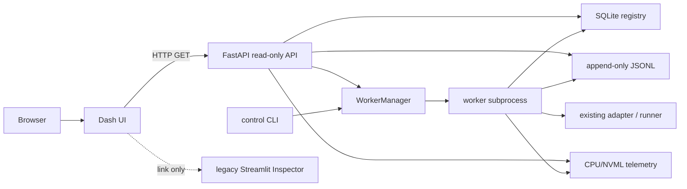

# Benchmark Execution Visualization — Independent Implementation Verification

## 1. Executive Verdict

Overall verdict: **NOT_READY**. The current working tree contains a substantial Phase 0/1/3 implementation and the isolated end-to-end lifecycle works, but the release cannot be accepted because the implementation is not present in the verified commit, the mandated full pytest command fails during collection, and numerical non-regression for the real benchmark adapters was not independently demonstrated.

| Gate | Verdict |
|---|---|
| Phase 0 — identity / typed config / immutable allocation | `ACCEPT_WITH_CONDITIONS` |
| Phase 1 — registry / events / lifecycle / telemetry / instrumentation | `ACCEPT_WITH_CONDITIONS` |
| Phase 3 — read-only API/dashboard / restart / legacy integration | `ACCEPT_WITH_CONDITIONS` |

Architecture verified: Dash frontend → HTTP FastAPI read-only API → SQLite/JSONL filesystem authority; CLI → detached worker process. `[CODE][RUN]` No frontend callback or API route launches training. `[RUN]` Playwright loaded the actual Dash DOM and displayed three persisted runs.

Actual end-to-end scenarios completed in an isolated root:

- normal synthetic worker: `STARTING → RUNNING → COMPLETED`, exit code 0, events/resources/logs on disk, API shutdown/restart recovery;
- ordinary injected exception: `FAILED`, exit code 40, failure event and traceback;
- verifier-started worker `SIGKILL`: stale `RUNNING` → reconciler `ORPHANED`, no false completion.

Findings: 3 High, 2 Medium, 1 Low. Release blockers: commit/reproducibility, full test collection, real-adapter numerical non-regression.

## 2. Scope, Baseline, and Method

The requested design documents and implementation documents were read from `docs/benchmark_visualization/benchmark_visualization_tool_docs/` plus the four implementation documents. Implementation documents were treated as claims, not evidence. Evidence labels used throughout are `[CODE]`, `[RUN]`, `[TEST]`, `[DOC-CLAIM]`, `[INFERENCE]`, and `[UNVERIFIED]`.

All experiments used synthetic fixtures and a separate verification root. No existing `runs/`, checkpoint, dataset, or registry was used as an output target. No production source was changed by this verification. The only created repository files are this report, its JSON summary, and the timestamped verification artifact directory.

## 3. Repository and Environment Snapshot

| Item | Result | Evidence |
|---|---|---|
| Repository root | `/home/dss-pc-05/bench` | `[RUN]` |
| Branch | `main...origin/main` | `[RUN]` |
| Current HEAD | `d1cc4b035597bb029e0bce95a546b29b4664b5c6` | `[RUN]` |
| Baseline commit | same as HEAD; commit range is empty | `[RUN]` |
| Working tree | dirty; many modified/deleted/untracked files | `[RUN]` |
| Control implementation status | `bench/control`, `bench/ui`, control tests are untracked | `[RUN]` |
| Submodules | revisions recorded; KalmanNet_TSP and MAML_KalmanNet have untracked `__pycache__` | `[RUN]` |
| Python | `/home/dss-pc-05/.pyenv/versions/3.10.13/bin/python`, CPython 3.10.13 | `[RUN]` |
| Torch/CUDA/GPU | torch 2.9.1+cu128, CUDA 12.8, CUDA available, one GPU | `[RUN]` |
| Installed control stack | FastAPI 0.141.1, Dash 3.4.0, Pydantic 2.13.4, psutil 7.2.2, pynvml, uvicorn | `[RUN]` |
| Manifest | `pyproject.toml`; `control` extra declares web/telemetry dependencies | `[CODE]` |
| Registry schema | version 1 | `[CODE][RUN]` |
| Event schema | version 1 | `[CODE][RUN]` |
| API | `/api/v1` | `[CODE][RUN]` |
| Dashboard command | `python -m bench.ui.dash_app --host ... --port ... --api ...` | `[CODE][RUN]` |
| Worker command | `python -m bench.control.process.worker_cli --run-id ... --registry ... --run-spec ...` | `[CODE]` |

The raw snapshot is in `artifacts/benchmark_visualization_verification/20260730T164756Z/environment.txt`, `git_diff_summary.txt`, and `docs_snapshot.txt`.

## 4. Claimed-vs-Verified Capability Matrix

| Capability | Claimed | Verified status | Evidence | User-visible risk |
|---|---|---|---|---|
| stable identity | supported | `PASS` | `[CODE][RUN][TEST]` UUIDv7 run IDs, SHA-256 variant IDs; cross-process output equal | low |
| typed config | supported | `PASS with scope limits` | `[CODE][TEST]` 160 control tests; explicit unsupported fields | adapter-specific knobs are not all typed |
| immutable run | supported | `PASS` | `[CODE][RUN]` atomic UUID directory allocation | none observed |
| SQLite registry | supported | `PASS` | `[CODE][RUN]` WAL, FK, timeout, migration and concurrency tests | scale smoke not done |
| JSONL events | supported | `PASS` | `[CODE][RUN][TEST]` bounded cursor reader and partial-tail recovery | invalid middle-line policy is warning/skip |
| separate worker | supported | `PASS` | `[CODE][RUN]` detached process group and file redirection | POSIX-only behavior |
| UI independence | supported | `PASS` | `[RUN]` worker alive after API termination | tested with synthetic worker only |
| restart recovery | supported | `PASS with representation issue` | `[RUN]` same run/event data after API restart | worker table may remain `STARTING` while run is `RUNNING` |
| live metric/log | supported | `PASS` | `[RUN]` API returned 11 events while state was `RUNNING`; logs on disk | no browser live-refresh assertion after mutation |
| CPU/GPU telemetry | supported | `PASS on this host` | `[RUN]` resource events; NVML device UUID/utilization/memory; CPU/RAM | process GPU attribution was unavailable (`device_only`) |
| failure/orphan | supported | `PASS` | `[RUN]` exception→FAILED; SIGKILL→ORPHANED | no automatic orphan kill, by design |
| read-only dashboard | supported | `PASS` | `[CODE][RUN]` GET-only routes; DOM smoke | no authentication; local-first only |
| legacy Inspector | supported | `PASS with conditions` | `[TEST]` legacy importer tests and 28-variant regression | no full new-run visualization mapping was produced by synthetic fixture |
| graceful stop | deliberately absent | `NOT_IMPLEMENTED_BY_DESIGN` | `[CODE][RUN]` capability false; no action routes | correct for this tranche |
| exact resume | deliberately absent | `NOT_IMPLEMENTED_BY_DESIGN` | `[CODE][RUN]` resume mode rejected; all capabilities false | correct; must not be enabled |
| config GUI launch | deliberately absent | `NOT_IMPLEMENTED_BY_DESIGN` | `[CODE][RUN]` CLI-only launch | correct for this tranche |

## 5. Git Diff and Architecture Boundary Audit

The most important repository fact is that HEAD equals the supplied baseline. The implementation and its tests are untracked working-tree content, so the current code cannot be reproduced from the verified commit. `[RUN]` This is finding `V-001`.

Dependency direction traced from imports:

`bench/ui` imports the API client and Dash, not training adapters. `bench/control` does not import Dash/Streamlit. API routes do not create subprocesses. `[CODE]` `WorkerManager.launch()` uses an argv list, `start_new_session=True`, `close_fds=True`, and per-run files; no `shell=True` was found in the control process path. `[CODE]`

Existing runner/model instrumentation is guarded and observer-based. `[CODE]` The third-party submodules have no tracked source diff, but two contain untracked Python cache files; this is contamination/noise rather than a numerical source change. `[RUN]`

## 6. Test Suite Results and Test Quality

| Command | Result |
|---|---|
| `python -m pytest --collect-only -q` | `587 collected, 1 collection error`; `bench/tests/test_report_schema_guardrails.py` relative import fails |
| `python -m pytest -q` | same collection error; no complete suite result |
| `python -m pytest -q --ignore=bench/tests/test_report_schema_guardrails.py` | `585 passed, 2 skipped, 1 warning, 30 subtests, 104.00s` |
| `python -m pytest -q tests/test_viz_init_provenance_comparison.py` | `28 passed` |
| control targeted tests | `160 passed, 1 warning, 19.61s` |

The 160 control tests include real subprocesses, real SQLite temporary files, failure injection, SIGKILL/orphan detection, API TestClient requests, and server-side Dash callbacks. `[TEST][CODE]` They are materially stronger than mocks for lifecycle claims. The Dash tests are not browser tests; the independent Playwright run below supplements them.

The excluded full-suite result is useful regression evidence but does not repair the collection failure. `[INFERENCE]` The implementation document's “full suite green” claim is therefore only true with an explicit exclusion, not for the mandated bare command.

## 7. Identity and Config Verification

`VariantId` is a SHA-256 canonical JSON content hash and `RunId` is a fresh UUIDv7. `[CODE]` Two independent Python processes produced the same variant, structural hash, and operational hash, but different run IDs. `[RUN]` The resulting evidence is in `event_samples/cross_process_identity.txt`.

The control tests cover model/init/implementation distinctions, presentation-label invariance, key ordering, operational-vs-structural hashes, invalid resume mode, and path safety. `[TEST]` Allocation uses `mkdir(exist_ok=False)` and creates run subdirectories only after a fresh leaf. `[CODE]`

Conditions: typed config is a dataclass execution contract, not a complete schema for every adapter-specific field. Unsupported fields are retained and surfaced rather than silently discarded, but full YAML preset coverage and CLI semantic parity were not independently run across every preset. `[CODE][UNVERIFIED]`

## 8. Registry and Migration Verification

New verification DB initialization created schema version 1. Production registry connection PRAGMAs were `journal_mode=wal`, `foreign_keys=1`, `busy_timeout=15000`; migration is idempotent and creates a backup when migrating a non-empty DB. `[CODE][RUN]` State transition and concurrency tests passed. `[TEST]`

The raw schema snapshot shows runs, transitions, workers, artifacts, checkpoints, leases, actions, and legacy mappings. Checkpoint/action/lease tables are present but their control behavior is not active in this tranche. `[CODE][RUN]`

## 9. Event Journal Verification

Real worker journals contain one-line UTF-8 JSON with schema version, monotonic event IDs, timestamp, event type, phase, step type/step, metric name/value/unit, bounded payload, and resource samples. `[RUN]` The normal run reached event 131 before terminal status; resource events were persisted independently of UI presence.

Appending a half JSON line caused the reader to return all 11 valid preceding events and a tail warning without losing the journal. `[RUN]` The evidence is `event_samples/partial_tail_recovery.json`. The event writer explicitly rejects oversized payloads and does not parse stdout to create metrics. `[CODE]`

The synthetic event sample separates `global_step` from phase and uses `loss/train_total`, `loss/validation_total`, and `metric/test_mse`. `[RUN]` Real-adapter namespace consistency and terminal-before-poll behavior remain partly unverified. `[UNVERIFIED]`

## 10. Worker and Process Lifecycle Verification

`WorkerManager` persists PID, PGID, host, process start time, worker token, and worker instance ID. `[CODE][RUN]` The worker PID equaled its PGID and differed from the shell/server process. stdout/stderr were redirected to run files.

The isolated normal scenario was launched with the API on port 18765. After killing only the verifier-started API process, the worker remained alive, continued writing, and after API restart the same run ID returned `RUNNING`, heartbeat, phase, global step, and journal cursor. It later returned `COMPLETED`, exit code 0, and a metrics artifact. `[RUN]` Raw responses are in `api_responses/run_*` and `api_responses/events_*`.

The independent live API poll captured `state=RUNNING events=11` before terminal state. `[RUN]` `api_responses/live_api_live_assertion.txt`.

Ordinary failure produced `FAILED`, exit code 40, `failure.json`, traceback artifact, failure event, and no completed artifact. `[RUN]` SIGKILL produced no exit code and no terminal event; reconciliation classified the run `ORPHANED` with `status_confidence=unknown`. `[RUN]`

The worker tests and code cover PID start-time defense. DataLoader child-process aggregation was not exercised because the synthetic worker uses no child loader processes. `[UNVERIFIED]`

## 11. Instrumentation and Numerical Non-Regression

The observer hook exists and the capability table is explicit. `[CODE][TEST]` Capability declarations report step-level coverage for KNet/Split and phase-level coverage for Adaptive/MAML/ME-Split/Basilisk, with exact resume false. `[CODE][RUN]`

The synthetic worker proves event timing and does not prove adapter numerical parity. I did not run a long benchmark, and no independent CPU deterministic A/B comparison of real adapter predictions, weights, update counts, and dataset fingerprints was completed. `[UNVERIFIED]` This is release blocker `V-003`; source inspection alone cannot establish numerical non-regression.

## 12. Telemetry Verification

CPU/RAM samples include PID/run association, process-tree CPU/RSS, system CPU/RAM, timestamp, and collector errors. `[RUN]` On this host NVML reported GPU index 0, UUID, name, whole-device utilization, whole-device memory, and temperature. Process GPU memory was null and attribution quality was `device_only`; the implementation correctly did not label whole-device memory as process memory. `[RUN]`

Telemetry failure/null behavior and optional backend handling are covered by targeted tests. `[TEST]` Measured telemetry overhead and a scale comparison were not performed. `[UNVERIFIED]`

## 13. API Verification

Actual HTTP calls returned 200 for health, GPUs, capabilities, and runs, and 404 for an unknown run. `[RUN]` Event cursor/limit, metrics, resources, artifacts, and bounded logs were exercised by the control tests and live isolated service. `[TEST][RUN]`

The API exposes read-only capability flags: launch, graceful stop, terminate, exact resume, warm-start API, multi-GPU queue, shared GPU, and authentication are false. `[CODE][RUN]` No POST/PUT/PATCH/DELETE route was found in the app. `[CODE][TEST]`

The API returns absolute `run_dir` and registry paths. This is acceptable only under the documented local-first/no-auth deployment; public bind is refused by default. `[CODE][RUN]` It remains a medium operational disclosure risk.

## 14. Frontend and Browser Verification

The Playwright browser smoke started the actual FastAPI and Dash servers, loaded `/runs`, and asserted DOM text for the title, table, and `ORPHANED`, `FAILED`, and `COMPLETED` rows. It saved `screenshots/runs.png`. `[RUN]` This is a real browser smoke, not an HTTP 200-only check.

Source inspection confirms row/route identity uses `run_id`, charts/logs are fetched through the API, and no lifecycle controls are rendered. `[CODE]` The live-update callback is polling-based and bounded, not WebSocket-based. `[CODE]`

## 15. Legacy Inspector and Import Verification

Legacy importer tests passed, including read-only tree fingerprint, idempotency, status confidence, unknown fields, and no resume certification. `[TEST]` The 28-variant identity/provenance regression passed independently. `[TEST]` The existing Streamlit source was not modified by this verification and no legacy artifact was overwritten. `[RUN]`

## 16. Security, Anti-Pattern, and Third-Party Audit

No control-plane `shell=True`, frontend training callback, API synchronous training handler, deterministic control run path, stdout-only metric generation, or automatic stale-heartbeat kill was found. `[CODE]` `model.pt` is documented and rendered as warm-start/non-resume, and all current exact-resume flags are false. `[CODE][RUN]`

The legacy visualization picker still contains a Python `hash(item.run_dir)` for a UI short key. `[CODE]` It is not used by the control registry identity path, but it should not be promoted into persistent identity.

No tracked third-party source diff was found; untracked `__pycache__` files exist in two submodules. `[RUN]` Their removal is outside this verification because the user prohibited unrelated destructive edits.

## 17. Performance Smoke Results

No 1,000/10,000-run synthetic registry scale fixture or large concurrent dashboard benchmark was run. `[UNVERIFIED]` The API and log endpoints are structurally bounded (`limit`, `offset`, tail seek, and 500 artifact cap) by code and tests, but practical scale latency remains unknown.

## 18. Deferred or Premature Features

Exact resume, graceful stop, config GUI launch, warm-start API, multi-GPU queue, shared GPU execution, and authentication are correctly absent and are `NOT_IMPLEMENTED_BY_DESIGN`. `[CODE][RUN]` No premature capability was exposed, so their extra acceptance tests were not applicable.

## 19. Findings by Severity

ID: `V-001`  
Severity: **High**  
Requirement: reproducible implementation baseline and implementation status  
Observed: verified HEAD equals the baseline commit; `bench/control`, `bench/ui`, control tests, and docs are untracked working-tree content.  
Expected: implementation and verification target must be represented by a reproducible commit or explicitly packaged revision.  
Evidence: `[RUN]` `git rev-parse`, empty commit range, `git status --short`.  
Reproduction: `git diff d1cc4b...HEAD` shows no implementation commit; `git status --short` lists the implementation as `??`.  
Impact: another verifier checking the commit will not see the implementation.  
Recommended correction: commit the intended implementation/docs/tests and record the exact commit; clean unrelated caches/artifacts separately.  
Release blocking: **yes**.

ID: `V-002`  
Severity: **High**  
Requirement: full regression reproducibility  
Observed: mandated bare pytest collection fails in `test_report_schema_guardrails.py` due attempted relative import with no known parent package.  
Expected: `python -m pytest --collect-only -q` and `python -m pytest -q` complete without collection errors.  
Evidence: `[RUN]` `pytest_collection.txt`, `pytest_results.txt`.  
Reproduction: run the two mandated commands from repository root.  
Impact: full suite status and baseline/new failure classification cannot be claimed.  
Recommended correction: repair test package/import layout or the declared collection configuration, then rerun the unmodified mandated commands.  
Release blocking: **yes**.

ID: `V-003`  
Severity: **High**  
Requirement: numerical non-regression under instrumentation  
Observed: only synthetic lifecycle metrics were independently observed; no real-adapter CPU deterministic A/B comparison of predictions/weights/fingerprints was performed.  
Expected: instrumentation enabled/disabled produces equivalent numerical semantics under a controlled tiny real-adapter fixture.  
Evidence: `[CODE][UNVERIFIED]` source hooks exist; no qualifying `[RUN]` result.  
Reproduction: run a tiny real KNet/Split fixture with observer/telemetry off and on and compare outputs.  
Impact: observer integration could alter RNG, mode, ordering, or numerical results unnoticed.  
Recommended correction: add and run a real-adapter deterministic parity test before release.  
Release blocking: **yes**.

ID: `V-004`  
Severity: **Medium**  
Requirement: durable worker status and clear API recovery  
Observed: after API restart, run state was `RUNNING` but API worker detail reported `worker_state=STARTING`.  
Expected: worker registry state and run state agree or the API explicitly labels the worker state as stale/last-known.  
Evidence: `[RUN]` `api_responses/run_after_restart.json`.  
Reproduction: inspect the normal isolated restart response.  
Impact: operator may misread a live recovered worker as never started.  
Recommended correction: update worker state on RUNNING transition or expose `last_known_worker_state` with freshness semantics.  
Release blocking: no, but fix before wider operations.

ID: `V-005`  
Severity: **Medium**  
Requirement: practical local-first API safety and scale evidence  
Observed: absolute filesystem paths are returned and no authentication exists; scale smoke was not measured.  
Expected: deployment warning plus deliberate path redaction/allowlist and a measured scale baseline.  
Evidence: `[CODE][RUN][UNVERIFIED]` API responses, bind safety, absent performance fixture.  
Reproduction: call `/api/v1/runs` and `/api/v1/system/health` on a non-loopback deployment or inspect returned JSON.  
Impact: accidental remote exposure leaks local layout; practical bottlenecks remain unknown.  
Recommended correction: keep loopback default, document trusted-proxy requirement, consider relative paths, and run scale smoke.  
Release blocking: no for local-only MVP.

ID: `V-006`  
Severity: **Low**  
Requirement: clean third-party isolation  
Observed: untracked `__pycache__` files exist inside two submodules.  
Expected: pristine submodule working trees for a reproducible audit.  
Evidence: `[RUN]` `git -C third_party/... status`.  
Reproduction: run `git submodule status` and per-submodule status.  
Impact: noise and possible accidental packaging, no observed numerical source change.  
Recommended correction: remove generated caches in a separate cleanup change.  
Release blocking: no.

## 20. Phase Gate Decisions

### Phase 0

Gate verdict: `ACCEPT_WITH_CONDITIONS`  
Passed requirements: canonical identity, stable cross-process variant, fresh run IDs, atomic allocation, typed resolved spec, structural/operational hashes. `[CODE][RUN][TEST]`  
Failed requirements: none in the isolated control tests.  
Unverified requirements: every supported YAML preset and full CLI semantic parity. `[UNVERIFIED]`  
Release blockers: `V-001`, `V-002` affect reproducibility/testing.  
Safe next action: commit the implementation and run the full collection gate.

### Phase 1

Gate verdict: `ACCEPT_WITH_CONDITIONS`  
Passed requirements: SQLite registry, JSONL journal, detached worker, heartbeat, stdio, ordinary failure, SIGKILL orphan, CPU/NVML telemetry, observer events. `[RUN][TEST]`  
Failed requirements: no direct failure of the implemented synthetic lifecycle.  
Unverified requirements: real-adapter numerical non-regression, DataLoader child tree, measured telemetry overhead. `[UNVERIFIED]`  
Release blockers: `V-003`.  
Safe next action: execute real tiny KNet/Split A/B parity tests and fix worker-state freshness.

### Phase 3

Gate verdict: `ACCEPT_WITH_CONDITIONS`  
Passed requirements: read-only API, Dash DOM smoke, restart recovery, bounded events/logs, legacy importer, 28-variant regression. `[RUN][TEST]`  
Failed requirements: none for the declared read-only scope.  
Unverified requirements: 1k/10k scale behavior and full visual workflows beyond the tested Runs page. `[UNVERIFIED]`  
Release blockers: `V-001`, `V-002` globally.  
Safe next action: repair collection, capture scale baseline, and keep write controls absent.

## 21. Required Fixes Before Next Tranche

1. Produce a reproducible commit containing the implementation, tests, and status documents; keep verification artifacts separate.
2. Repair the pytest collection error and rerun the two mandated bare commands.
3. Add a real CPU deterministic numerical parity test for at least KNet and Split with observer/telemetry toggles.
4. Correct or clearly label the stale worker-state representation after service restart.
5. Before deployment beyond localhost, decide whether absolute paths are acceptable and document the trusted-proxy/auth boundary.

## 22. Recommended Next Tranche

`READY_AFTER_BLOCKERS_FIXED` is the recommended transition label; the current release itself is `NOT_READY`. After V-001–V-003 are closed, proceed with scale/performance characterization and only then consider checkpoint/resume design. Keep graceful stop, exact resume, config GUI launch, and scheduling disabled until their separate acceptance contracts are implemented.

## Appendix A. Requirement Traceability Matrix

| Requirement ID | 07 implementation prompt requirement | Implementation claim | Actual related files | Verification plan/result |
|---|---|---|---|---|
| R0 | baseline snapshot | complete | docs, pyproject | `[RUN]` environment/git/test capture; baseline dirty |
| R1 | canonical identity types | complete | `bench/control/identity.py`, `canonical.py` | `[CODE][RUN][TEST]` pass |
| R2 | typed config/ResolvedRunSpec | complete | `bench/control/config/*` | `[CODE][TEST]` pass with adapter-scope condition |
| R3 | immutable allocation | complete | `allocation.py`, `paths.py` | `[CODE][RUN][TEST]` pass |
| R4 | SQLite WAL registry/migration | complete | `registry/sqlite.py`, migrations | `[CODE][RUN][TEST]` pass |
| R5 | JSONL journal | complete | `events/*` | `[CODE][RUN][TEST]` pass |
| R6 | subprocess/process group worker | complete | `process/manager.py`, `worker_cli.py` | `[CODE][RUN][TEST]` pass |
| R7 | heartbeat/stdout/failure/abrupt death | complete | process/registry | `[RUN][TEST]` pass |
| R8 | CPU/RAM/NVIDIA telemetry | complete | `telemetry/*` | `[RUN][TEST]` pass on host; attribution condition |
| R9 | observer and model instrumentation | complete/partial | observer, runner, model adapters | `[CODE][TEST]` hooks; real numeric parity `[UNVERIFIED]` |
| R10 | FastAPI + read-only dashboard | complete | `api/*`, `ui/*` | `[RUN][TEST]` pass; browser smoke pass |
| R11 | Streamlit connection | complete | legacy importer/API link | `[TEST]` importer and regression pass |
| R12 | unit/integration/browser smoke | complete claim | `tests/test_control_*` | `[TEST]` 160; `[RUN]` Playwright; full bare suite fails collection |
| R13 | implementation status docs | complete | docs | `[DOC-CLAIM]` present; reproducible commit condition fails |

## Appendix B. Commands and Raw Results

Artifact root: `/home/dss-pc-05/bench/artifacts/benchmark_visualization_verification/20260730T164756Z/`.

Important files: `commands.log`, `environment.txt`, `git_diff_summary.txt`, `pytest_collection.txt`, `pytest_results.txt`, `pytest_results_excluding_collection_error.txt`, `control_tests.txt`, `targeted_viz.txt`, `api_responses/`, `db_snapshots/`, `event_samples/`, `screenshots/`, `service_logs/`.

## Appendix C. Created Verification Fixtures

Only synthetic control-plane fixtures were created, under `test_run_roots/e2e/` and `test_run_roots/live_api/`. They contain three persisted runs in the E2E DB: one completed, one failed, and one orphaned. No existing benchmark artifact was modified by these experiments.

## Appendix D. Unknowns and Unverified Items

- real-adapter numerical A/B non-regression;
- all supported YAML preset round-trips and CLI semantic parity;
- DataLoader child process tree aggregation/cleanup;
- telemetry overhead measurement;
- 1,000/10,000-run and large-log scale smoke;
- complete browser workflow assertions for detail charts, resource charts, logs, failed/orphan detail, legacy deep link, and post-restart reload;
- exact resume, graceful stop, config GUI launch, scheduling, and authentication, intentionally out of scope for this tranche.
